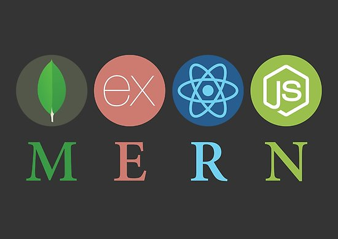

<p align="center">
  
</p>

<p align="center">
  
  <a href="https://app.netlify.com/sites/tnote/deploys"></a>
  <a href='https://coveralls.io/github/taniarascia/takenote'></a>
</p>

<p align="center">
  <a href="https://sonarcloud.io/dashboard?id=taniarascia_takenote"></a>
  <a href="https://sonarcloud.io/dashboard?id=taniarascia_takenote"></a>
</p>

<p align="center">Ecommerce Web App built with the MERN stack & Redux. </p>


Table of Contents
---

- 🚀 [Features](#features)
- 🧩 [Technology Stack](#technology-stack)
- 🟢 [ES Modules in Nodejs](#es-modules-in-nodejs)
- 🎬 [Run the project in your local machine](#run-the-project-in-your-local-machine)
  - 📊 [Environment Variables](#environment-variables)
  - 🔒 [Install Dependencies](#install-dependencies)
  - 📊 [Create Sample Data in Database](#create-sample-data-in-database)
  - ➡️ [Start the Project](#start-the-project)
- 📚 [Learning Resources](#learning-resources)


## Features
---
- Full featured shopping cart
- Product reviews and ratings
- Top products carousel
- Product pagination
- Product search feature
- User profile with orders
- Admin user, product management
- Admin order details page
- Mark orders as delivered option
- Checkout process (shipping, payment method, etc)
- Paypal/credit card integration
- Database seeder (products & users)

## Technology Stack
---
- MongoDB Atlas and MongoDB Compass Community
- Express
- React, React Bootstrap and Redux
- Nodejs
- Yarn

## ES Modules in Nodejs
---
ECMAScript Modules are used in the backend. Be sure to have at least `Node v14.6+` or you will need to add the `--experimental-modules` flag.

Also, when importing a file (not a package), be sure to add .js at the end or you will get a `module not found` error

You can also install and setup Babel if you would like.


# Run the project in your local machine

❗️ **Notes: Follow step by step in order to not run to any errors.**

❗️ **This project also has a lot of BUGS. Just mess around with the code in your local machine to find out more. Feel free to fix and contact me if you can.**
Example: Admin can delete himself, etc.

## Environment Variables
---
Create a .env file in the root and add the following variables. Add MongoDB URI and Paypal Client ID.

```
NODE_ENV = development
PORT = 5000
MONGO_URI = *mongodb uri*
JWT_SECRET = 'abc123'
PAYPAL_CLIENT_ID = *paypal client id*
```

## Install Dependencies
---
`yarn` is being used in this project. You might not be able to setup the project with `npm`. Download [yarn](https://classic.yarnpkg.com/en/docs/install/#windows-stable) here: https://classic.yarnpkg.com/en/docs/install/#windows-stable

When in the root folder, run these commands in command line to install all needed dependencies (packages). 

```
yarn install
```

Change directory in cmd to frontend folder, then run the same command to install all needed packages.
```
cd frontend
yarn install
```

## Create Sample Data in Database
---
Firstly, you should create some initial data to work first. You can use the following commands in `command line` to create the database with some sample users and products.

Import data
```
yarn run data:import
```

Sample User Logins. You're able to CHANGE both initial users and products for data seeding in `backend/data` folder. Check it for more details.
```
admin@gmail.com (Admin)
123456

user1@gmail.com (Customer)
123456

user2@gmail.com (Customer)
123456
```

❗️ ***Notes: You're able to destroy all data. Using it carefully***

Destroy all data
```
yarn run data:destroy
```

## Start the project
---
Using `concurrently` package can help us to run both frontend (React) and backend (Express) with just one command. As you might know, they run in two different servers, or localhost.

Guide: https://www.rockyourcode.com/javascript-development-run-concurrently/

Run front-end (3000) & back-end (5000)

```
yarn run dev
```

Run backend only
```
yarn run server
```

If you have any problems with this `concurrently` package, just uninstall and install it again, it might work well.

## Learning Resources
---
Check out the course: MERN eCommerce From Scratch. This is where I get the source code.

https://www.udemy.com/course/mern-ecommerce/

Before learning this course, there are some 🔥 PREREQUISITES 🔥 that you need to understand in order to get benefits from this course. Here are some of my 📚 trusted learning resources.

- Complete React Tutorial (with Redux)
https://www.youtube.com/watch?v=OxIDLw0M-m0&list=PL4cUxeGkcC9ij8CfkAY2RAGb-tmkNwQHG

- ReactJS Tutorial for Beginners
https://www.youtube.com/watch?v=QFaFIcGhPoM&list=PLC3y8-rFHvwgg3vaYJgHGnModB54rxOk3

- React Redux Tutorial
https://www.youtube.com/watch?v=9boMnm5X9ak&list=PLC3y8-rFHvwheJHvseC3I0HuYI2f46oAK

- Node.js Crash Course Tutorial
https://www.youtube.com/watch?v=zb3Qk8SG5Ms&list=PL4cUxeGkcC9jsz4LDYc6kv3ymONOKxwBU

- Node.js Auth Tutorial (JWT)
https://www.youtube.com/watch?v=SnoAwLP1a-0&list=PL4cUxeGkcC9iqqESP8335DA5cRFp8loyp
